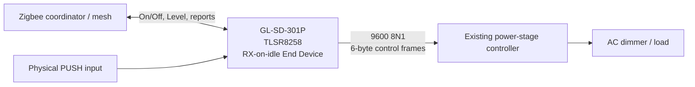

<div align="center">

# Gledopto firmware lab

### Make selected GLEDOPTO Zigbee devices better citizens of your mesh.

**Clean-room firmware, hardware interoperability research, and tooling for turning compatible mains-powered GLEDOPTO/Telink devices from Zigbee routers into always-awake End Devices (leaf nodes) — without giving up normal lighting control.**


</div>

---

## Why this project exists

A mains-powered Zigbee device is often shipped as a **Router**. That is useful when the router implementation is excellent. When it is not, the device can become an undesirable part of the mesh: children may attach to it, routes may traverse it, and failures can affect devices that otherwise have nothing to do with the light or dimmer.

This project explores a different option for compatible hardware:

> Keep the device mains-powered and permanently listening, but make it a **Zigbee End Device / leaf** so it controls its own load without routing traffic for the rest of the network.

This is **not** a generic firmware patch that can safely be applied to every GLEDOPTO product. Each hardware family must be understood and validated independently.

## First target: GL-SD-301P

The first implementation targets the **GLEDOPTO GL-SD-301P Zigbee AC dimmer**.

The independently written candidate firmware is designed as:

```text
ZB_ED_ROLE=1
ZB_ROUTER_ROLE=0
RX_ON_WHEN_IDLE=1
PM_ENABLE=0
POWER_SOURCE=MAINS
ENDPOINT=11
```

In other words: **not a router, not a sleepy battery device, but an always-awake mains-powered leaf node.**

The firmware also preserves the product-specific hardware path rather than replacing the mains dimmer logic. Research established a Telink TLSR8258-family Zigbee MCU talking to the existing power-stage controller over **9600 8N1 UART (PB1 TX / PA0 RX)**.



### What the candidate preserves

- Zigbee On/Off and Level Control
- physical PUSH control
- attribute reporting
- direct binding behavior
- reliable electrical OFF semantics
- startup synchronization
- the original secondary power-stage architecture
- OTA/recovery plumbing needed for controlled validation

### Current status

| Area | State |
|---|---|
| Hardware architecture | **Established** |
| Zigbee target | **RX-on-idle End Device** |
| Router role | **Disabled in candidate** |
| Pinned Telink SDK/toolchain build | **PASS** |
| Host interoperability tests | **PASS** |
| Safety/adversarial checks | **PASS** |
| Reproducible quarantined firmware | **PASS** |
| Single-device live canary | **Pending** |
| General/public OTA release | **Not authorized** |

The current frozen software candidate is tracked in **PR #6**. Its software gate is green; successful behavior on the physical production device still requires the controlled canary and post-flash validation. Do not interpret a green CI build as a blanket recommendation to flash hardware.

## Why this may be useful beyond one dimmer

The more interesting outcome is not one custom binary. It is a repeatable method for investigating other devices that are poor or unnecessary Zigbee routers.

A good future candidate is a device that:

1. is mains powered and therefore does not need sleepy operation;
2. uses a supported/researchable Zigbee MCU;
3. can keep its product-specific load controller intact;
4. has enough evidence to reconstruct its endpoint, clusters, GPIO and hardware interfaces safely;
5. would be more valuable to your network as an always-awake leaf than as a router.

That could eventually include additional GLEDOPTO dimmers, controllers, bulbs or related Telink-based hardware — **but support is model/revision specific, not assumed from branding alone**.

## What is actually in this repository

This repository is deliberately evidence-driven. It contains more than firmware source:

- [`devices/`](devices/) — per-device hardware and protocol ledgers
- [`evidence/`](evidence/) — captured, sanitized observations and analysis results
- [`tools/`](tools/) — firmware/static-analysis and validation tooling
- [`.github/workflows/`](.github/workflows/) — reproducible analysis/build gates
- [`AGENTS.md`](AGENTS.md) — automation/supervisor operating constraints
- [Issue #1](https://github.com/analienx/gledopto/issues/1) — the detailed GL-SD-301P engineering ledger
- [PR #6](https://github.com/analienx/gledopto/pull/6) — current clean-room End Device implementation and safety-gated build

The active implementation branch additionally separates vendor/reference evidence, the documented interoperability interface, and independently authored firmware so that one is not casually treated as the other.

## Want to investigate another device?

Please read [`CONTRIBUTING.md`](CONTRIBUTING.md) first. The most useful contribution is **evidence**: exact model/revision, Zigbee identity, endpoint descriptors, current role, software build/date code, logs, OTA metadata, photos or public documentation where legally shareable.

A request saying only “make this device an End Device” is usually not enough. A good evidence bundle can make a port dramatically more realistic.

## Safety and scope

This project deals with firmware for **mains-powered hardware**. Static analysis and successful CI do not establish electrical safety on an unknown hardware revision. Firmware must be matched to the exact target and validated through explicit gates.

No broad OTA publication, automatic mass update, or unrelated device mutation should be inferred from development artifacts in this repository.

Third-party/vendor firmware remains the property of its respective copyright holder. Reference material and independently authored implementation code must stay clearly separated, with provenance recorded where applicable.

---

<div align="center">

**Goal:** fewer unwanted Zigbee routers, while keeping the devices themselves fully useful.

If you own a GLEDOPTO/Telink device that looks like a good candidate, open a device-research issue with the evidence described in [`CONTRIBUTING.md`](CONTRIBUTING.md).

</div>
